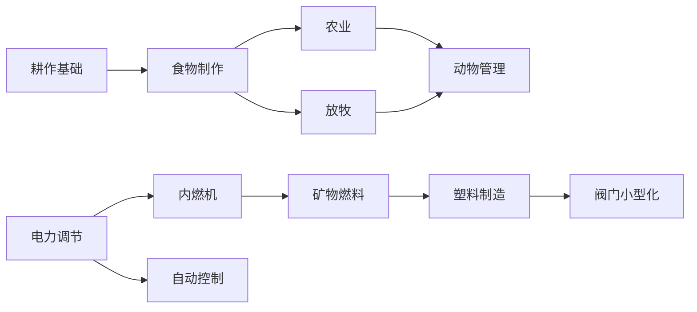

# Oxygen Not Include

## 顺序
1. 床*3
2. 抽水器，洗手池，厕所
3. 手动发电机，制氧机，科学机，小电池 `工作`
4. 招聘启事板 `耕作基础-食物制作`
5. 食物砖，食物加工机，餐桌 `电力调节` 
6. 电池 `室内装修-艺术表现`
7. 画，雕像 `高级研究`
8. 超级计算机 `农业`
9. 液培砖 `内燃机`
10. 氧气室：
    - 电池组
    - 燃煤发电机 `通风-气压管理` 
    - 透气砖 `管道安装-空气系统` 
    - 电解器 
    - 气泵 `过滤`
    - 气体过滤器 `高级电力调节`
    - 氢气发电机
11. 卫生间
    - 液泵 `卫生设施`
    - 水池，厕所，淋浴 `蒸馏`
    - 滤水筛子 `净化机`
12. 除臭剂 `自动控制-通用传感器`
13. 气体元素传感器 `温度调节` 
14. 隔热砖 `蛮力精炼-精炼物体-熔炼` 
15. 精炼金属 

## 部分

1. 浴室
    - 水池
    - 厕所
    - 淋浴
2. 
2. 氧气，氢气
3. 天然气

## 科技

