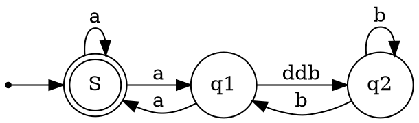
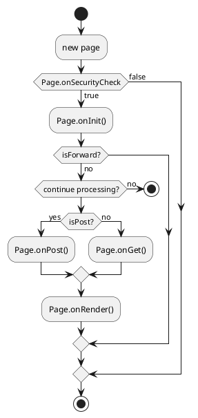

# diagram

## ditta

```
                +-------------+
                | Asciidoctor |-------+
                |   diagram   |       |
                +-------------+       | PNG out
                    ^                 |
                    | ditaa in        |
                    |                 v
+--------+   +--------+----+    /---------------\
|        | --+ Asciidoctor +--> |               |
|  Text  |   +-------------+    |   Beautiful   |
|Document|   |   !magic!   |    |    Output     |
|     {d}|   |             |    |               |
+---+----+   +-------------+    \---------------/
    :                                   ^
    |          Lots of work             |
    +-----------------------------------+
```

### mermaid

[[mermaid]]

### graphviz

[[graphviz]]

需要插件[graphviz-markdown-preview](https://github.com/geeklearningio/graphviz-markdown-preview)支持



### plantuml

> enhance支持

[[plantuml]]



### flow

> enhance支持

```flow
//定义类型和描述
st=>start: 开始
e=>end: 结束
op=>operation: 我的操作
cond=>condition: 判断确认？
st->op->cond
cond(yes)->e
cond(no)->op
```

```flow
st=>start: 开始
e=>end: 结束
op=>operation: 获取文件
op1=>operation: 解析文件
op2=>operation: 对账处理
op3=>operation: 失败
cond1=>condition: 连接成功or失败
cond2=>condition: 重试<3
io1=>inputoutput: 差错文件导出（统计结果、文件）
st->op->cond1
cond1(yes)->op1->op2->io1->e
cond1(no)->cond2
cond2(yes)->op
cond2(no,down)->op3->e
```