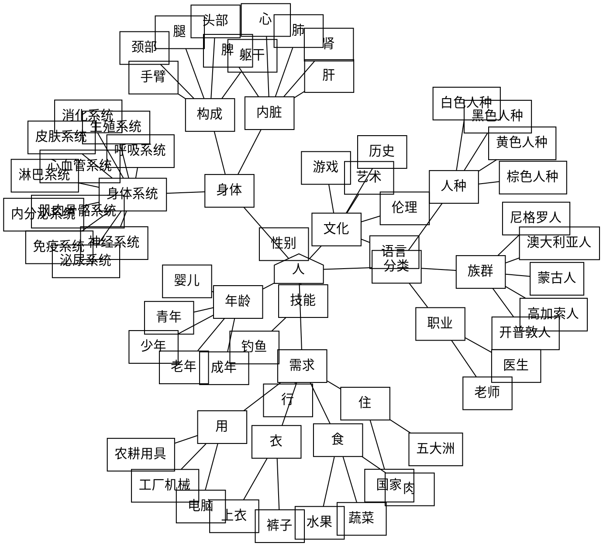

# people

```graphviz
graph g {
	layout=neato // dot, fdp, default: dot
	node [shape=house] 人
	node [shape=box]; // box, ellipse, circle, house, pentagon, default: ellipse
	
	人 -- {分类, 技能, 需求, 年龄, 性别, 身体, 文化}

	分类 -- {族群, 人种, 职业}
	技能 -- {钓鱼}
	需求 -- {衣, 食, 住, 行, 用}
	年龄 -- {婴儿, 少年, 青年, 成年, 老年}
	文化 -- {艺术, 历史, 游戏, 语言, 伦理}
	身体 -- {构成, 身体系统, 内脏}
	构成 -- {腿, 躯干, 手臂, 颈部, 头部}
	身体系统 -- {神经系统, 心血管系统, 消化系统, 内分泌系统, 免疫系统, 皮肤系统, 淋巴系统, 肌肉骨骼系统, 生殖系统, 呼吸系统, 泌尿系统}

	族群 -- {蒙古人, 高加索人, 尼格罗人, 澳大利亚人, 开普敦人}
	人种 -- {棕色人种, 黑色人种, 白色人种, 黄色人种}
	职业 -- {医生, 老师}
	内脏 -- {心, 肝, 脾, 肺, 肾}

	衣 -- {上衣, 裤子}
	食 -- {蔬菜, 水果, 肉}
	住 -- {五大洲, 国家}
	用 -- {农耕用具, 工厂机械, 电脑}
}
```