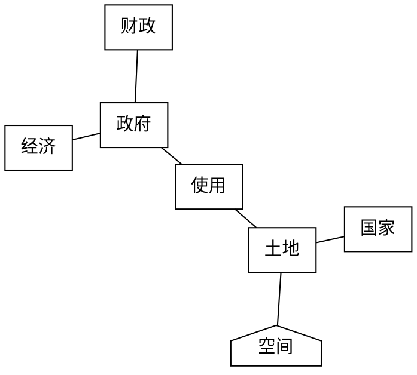

```graphviz
graph g {
	layout=neato // dot, fdp, default: dot
	rankdir="TB" // TB, LR, default: TB
	node [shape=house] 空间
	node [shape=box]; // box, ellipse, circle, house, pentagon, default: ellipse
	空间 -- {土地}

	土地 -- {国家, 使用}

	使用 -- {政府}

	政府 -- {财政, 经济}
}
```

1. 自 1990 年 国务 院规定土地使用权可 以有偿 出让 开始 ，① 土地使用权市场正式 出现并建立起来 
2. 以土地出让金为核心的土地财政成为推动经济增长的主要动力 之一 